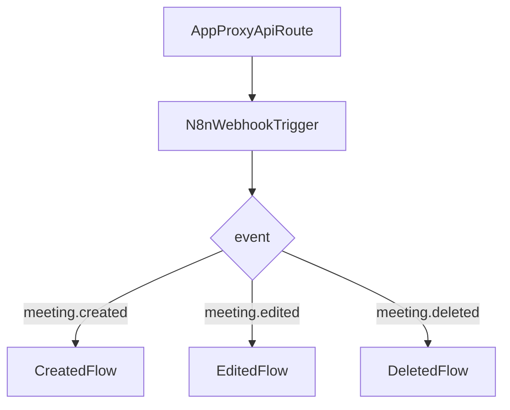

# n8n VPS migration

This app already sends meeting events to n8n through a single authenticated server-side proxy:

- app route: `/api/n8n/meetings`
- implementation: `app/api/n8n/meetings/route.ts`

The safest migration path is to keep that app contract unchanged and point it at a new webhook on your VPS-hosted n8n instance. Then branch into separate workflow logic inside n8n based on the `event` field.

## Required environment variables

Set these variables in the environment where the Next.js app runs:

```env
N8N_MEETINGS_WEBHOOK_URL=https://n8n.katarzynapietryka.com/webhook/meetings
N8N_MEETINGS_AUTH_HEADER_NAME=X-Webhook-Secret
N8N_MEETINGS_AUTH_HEADER_VALUE=replace-with-a-random-secret
```

Notes:

- `N8N_MEETINGS_WEBHOOK_URL` should point to the new n8n webhook trigger URL.
- The auth header values are optional in the app, but recommended for a public VPS endpoint.
- Do not commit real secrets to git.

## What the app sends

The request body is validated with `lib/schemas/n8n-meetings.ts` before being forwarded to n8n.

All forwarded payloads also include:

- `adminEmails`: a comma-separated string built from `ADMIN_EMAILS`

Supported event types:

### `meeting.created`

```json
{
  "event": "meeting.created",
  "meetingId": "m1",
  "title": "Anna Kowalska",
  "description": "First visit",
  "category": "online",
  "date": "2026-03-17",
  "time": "09:00",
  "duration": 50,
  "userId": "user_123",
  "userEmail": "guest@example.com",
  "userPhone": "+48500123456",
  "createdAt": "2026-03-10T10:00:00.000Z",
  "lastEditedBy": "admin",
  "updatedAt": "2026-03-10T10:00:00.000Z",
  "adminEmails": "admin@example.com,other@example.com"
}
```

### `meeting.edited`

```json
{
  "event": "meeting.edited",
  "editedBy": "admin",
  "meetingId": "m1",
  "title": "Anna Kowalska",
  "description": "Moved to a new slot",
  "category": "w_gabinecie",
  "date": "2026-03-18",
  "time": "10:15",
  "duration": 50,
  "userEmail": "guest@example.com",
  "userPhone": "+48500123456",
  "status": "not_confirmed",
  "previousDate": "2026-03-17",
  "previousTime": "09:00",
  "previousDuration": 50,
  "changeRequestedAt": "2026-03-10T10:00:00.000Z",
  "updatedAt": "2026-03-10T10:00:00.000Z",
  "adminEmails": "admin@example.com,other@example.com"
}
```

### `meeting.deleted`

```json
{
  "event": "meeting.deleted",
  "deletedBy": "user",
  "meetingId": "m1",
  "title": "Anna Kowalska",
  "description": "Cancelled visit",
  "category": "online",
  "date": "2026-03-17",
  "time": "09:00",
  "duration": 50,
  "userEmail": "guest@example.com",
  "deletedAt": "2026-03-10T10:00:00.000Z",
  "adminEmails": "admin@example.com,other@example.com"
}
```

## Recommended n8n workflow shape

Use one public webhook in n8n and branch internally:



Recommended node layout:

1. `Webhook` node for POST JSON input.
2. `Switch` node on `{{$json.event}}`.
3. One branch or `Execute Workflow` node per event type.
4. Shared email or notification helpers only after the event-specific split.

## Current app trigger points

The app sends `meeting.created`, `meeting.edited`, and `meeting.deleted` events from:

- `components/admin/AdminCalendar.tsx`
- `components/guest/GuestDashboard.tsx`

You should not need to change those components if the new n8n workflow keeps the same payload contract.

## Verification checklist

After configuring the new webhook:

1. Create a meeting as a guest and confirm the new n8n workflow receives `meeting.created`.
2. Edit a meeting as a guest and confirm `meeting.edited`.
3. Create, edit, and delete a meeting as an admin and confirm the expected event arrives each time.
4. Verify the auth header is required and accepted by the new n8n webhook.
5. Verify downstream email and workflow behavior on the VPS matches the old automation.
